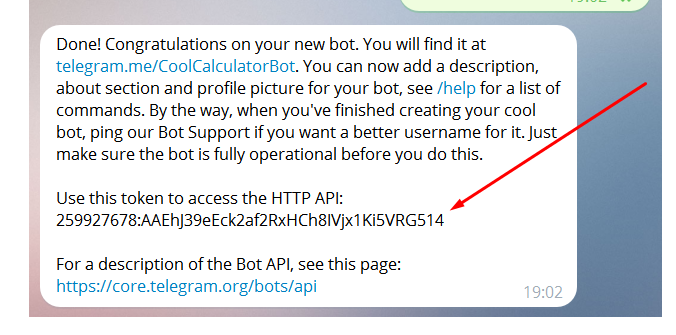

#  Space Telegram
****
### Description
The project contains a set of scripts designed to download space-themed photos<br>
and then send them to a telegram group using a telegram bot.

### Installation and launch
- Install dependencies from requirements.txt file
```
pip install -r requirements.txt
```
- generate API NASA API KEY (https://api.nasa.gov)


- create a bot and a group in telegram, instructions for creating a bot <br>
(https://medium.com/spidernitt/how-to-create-your-own-telegram-bot-63d1097999b6)


-  Add the ".env" file to the project folder and enter the following data:
```
TELEGRAMM_TOKEN='we get the token when registering the bot using the link https://telegram.me/BotFather'
```    

```
NASA_TOKEN='token received by registration on the site https://api.nasa.gov'
```
```
CHAT_ID='chat id, assigned when creating a chat, starts with "@" '
```

****
#### There are three scripts for downloading photos from different resources:
* astronomy_picture_of_the_day
launch run the command:  
```
python astronomy_picture_of_the_day.py
```
* earth_polychromatic_imaging_camera
launch run the command:  
```
python earth_polychromatic_imaging_camera.py
```
* fetch_spacex_image
launch run the command:  
```
python fetch_spacex_image.py
```
The etch_spacex_image script can be run with an optional id parameter (flight number id),<br>
if id is not specified, photos from the last flight will be loaded

launch run the command with flight number id:  
```
python fetch_spacex_image.py --id 5eb87d47ffd86e000604b38a
```

****
All images will be downloaded to the image folder (created automatically) in the root directory of the project
****
#### Two scripts for sending photos to a telegram group using a telegram bot:

* telegramm_bot_one_time_used<br>

Used to send one photo. It is possible to use the optional argument "image_path" <br>
(the name of the downloaded file), if the argument is missing, a random photo from the image<br>
folder will be downloaded.

launch run the command:  
```
python telegramm_bot_one_time_used.py
```
launch run the command with argument "image_path":  
```
python telegramm_bot_one_time_used.py --image_path image/NASA_APOD_4.jpg
```
* telegramm_bot_сycle_used

This script works in an endless loop, constantly sending a photo every 4 hours,<br>
from the image folder. The time interval can be specified as an optional argument in seconds

launch run the command:  
```
python telegramm_bot_сycle_used.py
```
launch run the command with 10 sec time interval: 
```
python telegramm_bot_сycle_used.py --time_sec 10
```
### Project Goals

The code is written for educational purposes on online-course for web-developers [dvmn.org](https://dvmn.org/).